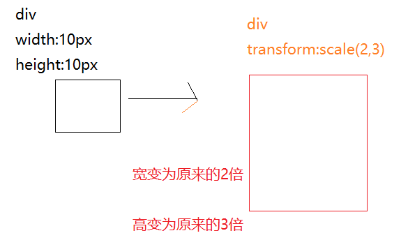
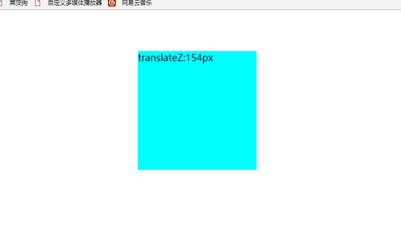
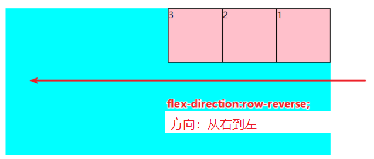
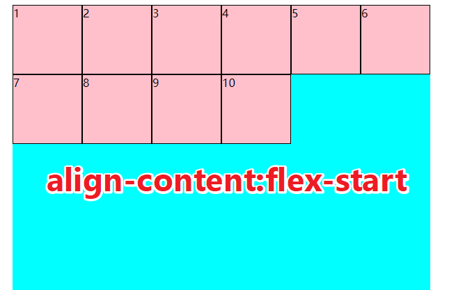
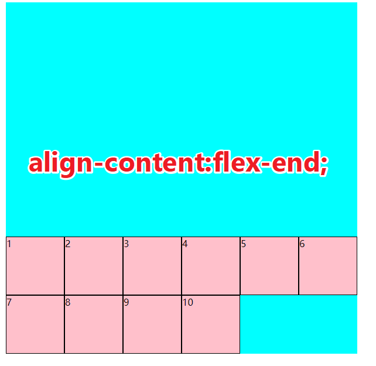
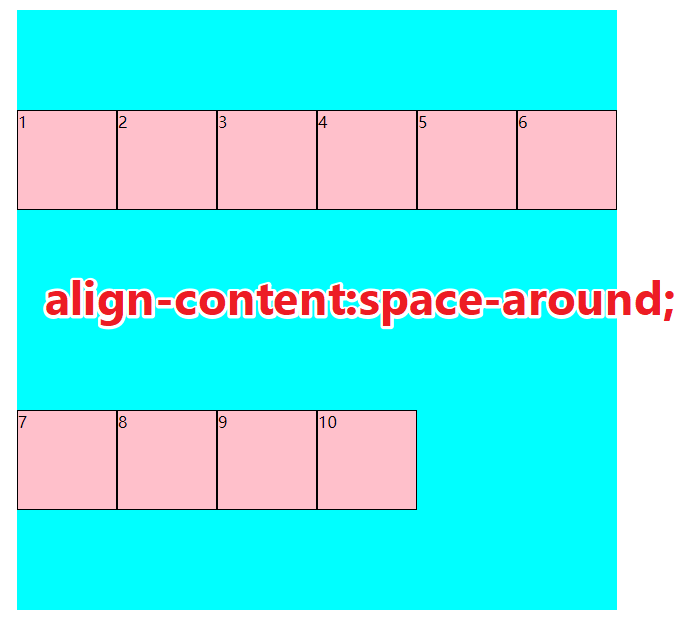
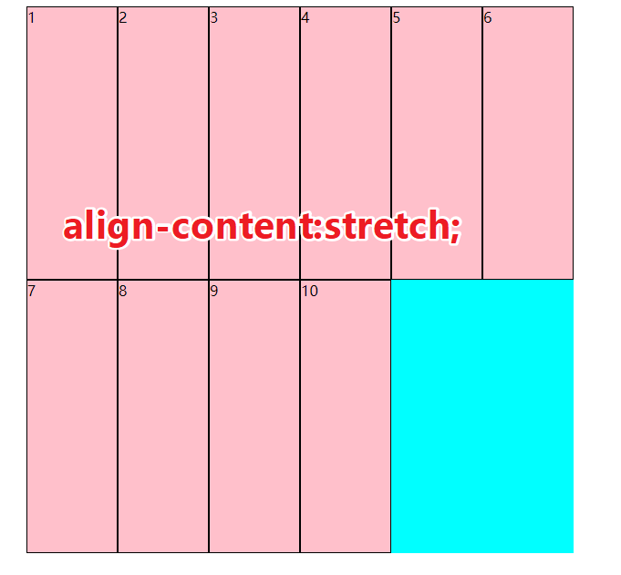
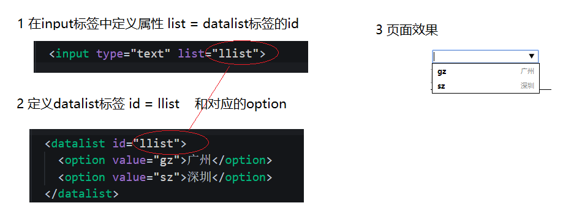

# HTML5

## 介绍

​	[百度百科](https://baike.baidu.com/item/html5/4234903) 

​	HTML5是HTML4的升级版

​	HTML5新增了和优化了

- 新的语义化标签

- 本地存储功能

- 多媒体功能

- 画布功能

- 新的javascript 的API

- 浏览器本地应用功能

- CSS3

  

  ​	日常我们所说HTML5其实是一个统称,它其实包含了

  > HTML5 = 新的标签 + css3 + 新的javascript API


考虑到如何让同学们可以更好的吸收HTML5课程的知识.那么本次课程顺序安排是 **前四天讲CSS3,后两天讲H5新标签和H5新增的api**

# H5第1天

## 学习目标

- 理解

  - 理解和使用盒子模型的内减模式
  - 理解和设置常见边框圆角
  - 掌握线性渐变的设置
  - 理解和使用过渡属性实现常见效果
  - 理解和使用2d转换实现常见效果

- 应用
1. 实现安卓渐变机器人

   

2. 过渡点灯

3. 过渡手风琴

4. 旋转扑克牌

5. 盾牌

6. 哆啦a梦

   


## 盒子模型

在css3中，计算盒子宽度的方式分为两种：1 传统模式 **2 内减模式**  

两者的区别主要是体现在**计算元素的宽度或者高度的方式上**。通过 `box-sizing` 属性来控制

### 传统模式 

我们一直在写的元素的盒子模型，默认就是传统模式        `box-sizing: content-box;`

```css
    div {
      width: 10px;
      border-left: 1px solid #000;
      padding-left: 1px;
      box-sizing: content-box;/* 可以省略 */
    }
```


盒子的宽度计算方式为：

> 盒子的宽度 = border + padding + width

### 内减模式

- 传统模式 宽度计算   **盒子的宽度 =  css中设置的width + border + padding** 
- 内减模式 宽度计算  **盒子的宽度 = css中设置的宽度width**   

属性值为  `border-box` 

```css
    div { 
      width: 10px;
      border-left: 1px solid #000;
      padding-left: 1px;
      box-sizing: border-box;/* 内减模式 */
    }
```


盒子的宽度计算方式为：

> 盒子的宽度 = contentWidth + border + padding


**观察得出：内减模式的特点**

- 元素真实的宽度就是css中设置的宽度
- 当css中的width定好了之后，动态的改变 border 或者 padding，只有内容的宽度减小。

### 应用场景

1. 常用在样式的初始化中，避免一个像素之差导致的布局换行  

   > *｛box-sizing:border-box;｝


## 边框圆角

### 概念

让元素具有圆滑的边角  

每一个元素都拥有4个角，分别是 **左上，右上，右下，左下**


### 语法1

 `border-radius:像素|百分比;`   

- 设置元素的4个边角的圆滑程度 
- 百分比是相对于父元素的宽度或者高度

```css
    div{
      width: 200px;
      height: 200px;
      background-color: aqua;
      border-radius: 60px;
    }
```


### 语法2

 `border-radius: 30% 10%;`   

```css
    div {
      width: 600px;
      height: 600px;
      background-color: aqua;
      border-radius: 30% 10%;
    }
```

**左上** 和 **右下** 对应 为 30%    

**右上** 和 **左下** 对应 为 10% 


### 语法3(了解)

`border-radius:像素 / 像素`

反斜杠 `/`  **之前** 设置的都是  **边角的水平半径** 

反斜杠 `/`  **之后** 设置的都是  **边角的垂直半径** 

```
    div {
      width: 600px;
      height: 600px;
      background-color: aqua;
      border-radius: 90px / 150px ;
    }
```


### 例子（了解）

这个例子主要用来说明边框圆角具有一个 **修复效果** 如

```css
  div {
    width: 600px;
    height: 600px;
    background-color: aqua;
    border-radius: 100% 0 0 0;
  }
```


**修改代码**

接下来把代码改成 `border-radius: 100% 100% 0 0;` 你会发现变成


这个效果 和你在代码中写 

`border-radius: 50% 50% 0 0;` 是一模一样的。


因为  **当边框圆角相邻的两个角的值相等并且同时大于50%时，浏览器会自动调整为50%**


## 线性渐变 linear-gradient


**渐变分4种，分别是**

- **线性渐变**
- 径向渐变 了解
- 重复线性渐变 了解
- 重复径向渐变 了解

因为线性渐变使用的最频繁， 我们学习**线性渐变**即可，其他只需了解

### 概念

线性渐变 是指渐变的方向是呈直线型的渐变。

### 注意

只能给以下属性添加渐变

- backgroundImage
- background

给 `backgroundColor` 添加没有效果！


### 语法

`background-image: linear-gradient(方向？，颜色 颜色开始的位置，颜色 颜色结束的位置，，，);`

```css
  div {
    width: 600px;
    height: 600px;
    background-image: linear-gradient(black,red);
  }
```

#### 方向

- 系统内置方向  `to top|to bottm|to left|to right|to right top ` 默认值是 `to bottom` 
- 自定义方向 `0deg或者1deg`等

```css
  div {
    width: 100px;
    height: 100px;
    background-image: linear-gradient( to right top, black,red);
  }
```


#### 颜色 开始的位置 ,颜色 结束的位置

- 颜色  `red或者#000或者rgba`等
- 开始位置（省略了 默认就是0） 单位是 `px或者百分比（相对于自身的宽或者高）`   


- 结束的位置（省略了 默认就是百分100%）

#### 例子

```css
  div {
    width: 100px;
    height: 100px;
    background-image: linear-gradient( black 5%,red 10%,yellow 100%);
  }
```


## 过渡 transition

过渡就好像是jquery中的animate方法一样，可以看到元素的变化的整个过程。


如想要看到div的宽度由1000px变为100px的过程

1. 给div的宽度添加过渡属性 `transition-property: width;`
2. 设置过渡持续时间  `transition-duration: 3s; `
3. 鼠标移入div 即可。

```css
    div {
      width: 1000px;
      height: 100px;
      background-color: aqua;
      /* 要过渡的属性 width*/
      transition-property: width;
      /* 过渡的持续时间 3s*/
      transition-duration: 3s;
    }

    div:hover{
      width: 100px;
    }
```

### 语法

完整的参数设置如下

| 属性                       | 描述                                         |
| -------------------------- | -------------------------------------------- |
| transition                 | 简写属性，用于在一个属性中设置四个过渡属性。 |
| transition-property        | 规定应用过渡的 CSS 属性的名称。              |
| transition-duration        | 定义过渡效果花费的时间。默认是 0。           |
| transition-timing-function | 规定过渡效果的时间曲线。默认是 "ease"。      |
| transition-delay           | 规定过渡效果何时开始。默认是 0。             |

1. **要过渡的属性**  

   > 如width，height  `transition-property: width;`   写`all`代表全部

2. **持续时间** 

   > 设置过渡的持续时间  如 `transition-duration:10s`

3. **速度曲线**

   设置变化的速度曲线 如匀速等  

   - linear： 匀速
   - ease： 慢-快-慢  默认值
   - ease-in： 慢-快。
   - ease-out： 快-慢。
   - ease-in-out： 慢-快-慢。

4. **延迟时间**

   设置产生过渡时的延迟时间 如   `transition-delay: 10s;`

### 复合写法 

​	可以使用复合写法

```css
 /* 过渡的属性为width 持续3s 匀速 延迟0s */
   transition: width 3s linear 0s;
```

### 多个过渡写法

可以同时对一个元素的多个属性添加过渡   对宽度和高度设置不同的过渡

```css
  transition: 
        width 1s ease-in 1s,
        height 10s ease-in-out 2s;
```

### 过渡结束事件 

元素在执行过渡结束之后，会自动触发的事件 **transitionend**   

```javascript
    var div = document.querySelector("div");
    div.addEventListener("transitionend", function () {
      console.log("div的过渡结束之后，触发");
    })
```


## 2D转换（变换）transform

2d转换是改变标签在**2维平面**上的**位置和形状**的一种技术，先来学习2维坐标系

### 2维坐标系

**2维坐标系**其实就是指布局的时候的坐标系 如图


### 2d移动 translate

2d移动是2d转换里面的一种功能，可以改变元素在页面中的位置，类似 **定位**

使用2d移动的步骤：

1. 给元素添加 **转换属性**  `transform`
2. 属性值为 `translate(x,y)`  如  `transform:translate(50px,50px)`;

```css
  div{
    transform: translate(50px,50px);
  }
```


#### 小结

1. **translate**中的百分比单位是相对于自身元素的  `translate:(50%,50%);`
2. **translate**类似定位，不会影响到其他元素的位置
3. 对行内标签没有效果

### 2d旋转 rotate

2d旋转指的是让元素在2维平面内顺时针旋转或者逆时针旋转

使用步骤：

1. 给元素添加转换属性 `transform`
2. 属性值为 `rotate(角度)`  如 `transform:rotate(30deg)`  顺时针方向旋转**30度**

```css
div{
      transform: rotate(0deg);
}
```

在浏览器中手动修改 **rotate**


观察过后，2d旋转有以下特点

1. 角度为正时 顺时针 负时 为逆时针
2. 默认旋转的中心点是元素的中心点

### 转换中心 transform-origin 了解

该属性可以修改元素旋转的时候的中心点

1. transform-origin:**50% 50%;**  默认值  元素的中心位置 百分比是相对于自身的宽度和高度
2. transform-origin:**top left;**  左上角   和 transform-origin：0 0;相同
3. transform-origin:**50px 50px;**  距离左上角 50px 50px 的位置
4. transform-origin：**0**;  只写一个值的时候  第二个值默认为 50%;

### 2d缩放 scale

缩放，顾名思义，可以放大和缩小。 只要给元素添加上了这个属性就能控制它放大还是缩小 

步骤：

1. 给元素添加转换属性 `transform`
2. 转换的属性值为 `scale(宽的倍数,高的倍数)`    如 宽变为两倍，高变为3倍 `transform:scale(2,3)`

```css
div{
    transform:scale(2,3);
}
```



#### 小结

1. transform:scale(1,1) 放大一倍 相对于没有放大
2. transform:scale(2,2) 宽和高都放大了2倍
3. transform:scale(2)  只写一个参数 第二个参数则和第一个参数一样 相当于 scale(2,2)
4. transform:scale(0.5,0.5)  缩小 
5. transform:scale(-2,-2) 反向放大2倍    很少用负数 容易让人产生误解


# H5第2天

## 学习目标

- 理解
  - 3d转换的中的3d移动，3d旋转
  - 动画属性的设置和使用
  - animate.css动画库的使用
- 应用
  - 实现3d立方体
  - 无缝滚动
  - 正在等待图标的制作
  - 自己实现animate.css


## 3D转换（变换）

3d转换是改变标签在3**坐标系**上的**位置和形状**的一种技术   以下知识点最好结合 [3d模型工具来理解](~@alias/3d演示工具.html)

### 3维坐标系

3维坐标系其实就是指立体空间，立体空间是由3个轴共同组成的  

- x轴 水平向右 
- y轴 垂直向下 
- z轴 垂直屏幕 由屏幕里面指向屏幕的外面  

 


### 3d移动 translate3d

3d移动在2d移动的基础上多加了一个可以移动的方向，就是z轴方向


**语法：**

1. transform:**translate3d**(x,y,z)  其中 **x y z** 分别指要移动的轴的方向的距离
2. translform:**translateX**(100px)  仅仅是移动在x轴上移动
3. translform:**translateY**(100px)  仅仅是移动在Y轴上移动
4. translform:**translateZ**(100px)  仅仅是移动在Z轴上移动  

**注意**:

因为z轴是垂直屏幕，由里指向外面，所以 默认是看不到元素在z轴的方向上移动，想要看到，可以使用下面的 **视距** 属性设置


### 视距 perspective了解

人在看物体时，有个规律，如 **远的物体看起来小** **近的物体看起来大**   

**perspective** 就是用来设置  **人** 和 **物体** 的距离      


如 我们想要看到 物体 在z轴上的移动  的 **远大近小** 效果时  

1. 设置物体的 `translateZ` 一般大于 0  如  `transform:translateZ(100px)`
2. 设置 人和物体的距离 - 视距    这个值规定要设置给**物体的父元素**   `perspertive:1000px`
3. 动态改变物体的 `translateZ` 即可观察效果

```css
    /* 父元素 */
    body {
      /* 视距 */
      perspective: 1000px;
    }

    /* 目标 */
    div {
      width: 200px;
      height: 200px;
      background-color: aqua;
      margin: 100px auto;
      /* z轴的移动 */
      transform: translateZ(0px);
    }
```



#### 小结

1. translateZ的值和perspertive都要大于0 否则容易出现兼容性问题


### 3d旋转 rotate3d

3d旋转指可以让元素在3维平面内沿着 **x轴，y轴，z轴或者自定义轴**进行旋转  对于元素旋转的方向的判断 我们需要先学习一个**左手准则**

#### 左手准则

比如要判断某元素沿着x轴是怎么旋转的

1. 左手的手拇指指向 x轴的正方向
2. 其余手指的弯曲方向就是该元素沿着x轴旋转的方向了


#### 例子1

我现在想让元素沿着 x轴正方向旋转90度

```css
    /* 沿着x轴正方向旋转90度 deg为单位 */
      transform: rotateX(90deg);
```

  


可以通过自己的代码测试 让物体沿着y轴 z轴旋转，加深了解。

#### 语法

1. `transform:rotateX(45deg);` 沿着x轴正方向旋转 45度
2. `transform:rotateY(45deg)` 沿着y轴正方向旋转 45deg
3. `transform:rotateZ(45deg)` 沿着Z轴正方向旋转 45deg
4. `transform:rotate3d(x,y,z,deg)` 沿着自定义轴旋转 deg为角度  了解即可

### 3D缩放 scale3d 了解

3d缩放 可以控制元素 在 x轴，y轴，z轴上的缩放，也可以理解为 宽，高，厚度的缩放。 结合[3d模型工具学习](3d演示工具.html)

#### 语法

1. `transform: scale3d(1 ,1,2);`  宽，高 缩放一倍，厚度放大两倍
2. `transform: scaleX(1)` 只缩放宽
3. `transform: scaleY(1)` 只缩放高
4. `transform: scaleZ(1)` 只缩放厚  

### 视距原点 perspective-origin 了解

回顾**视距**知识点，

视距可以设置 **人 和 物体** 之间的距离 也就是z轴方向的距离   

而  **视距原点** 可以设置 人 站在x轴和y轴的位置。


1. 视距原点和视距一样，也是设置给要观察元素的**父元素**上
2. perspective-origin:center center; 默认值是**元素的中心点**
3. perspective-origin:10px；  指定了一个参数的时候，第二个参数默认为center 也就是50%；
4. perspective-origin:10% %； 百分比都是相对于自身的宽度和高度


### 转换样式  transform-style 了解

结合3d立方体案例理解，控制**子元素**是否开启3维立体环境

-  `transform-style: flat;`  平面模式  -  不开启3维立体环境
- `transform-style: preserve-3d;`  3维立体环境

### 3D转换总结

1. 百分比单位都是相对于自身
2. 视距、视距原点、转换样式 这三个属性都是给**父元素**添加的


## 动画 animation

初学者容易对 **动画** 和 **过渡** 傻傻分不清楚

过渡 只能看到一次变化过程 如 **宽度  1000px  变化到  100px** 

**动画 可以设置变化的次数 甚至是无数次**   


### 步骤

1. 在css中定义动画函数     

2. 给目标元素调用动画函数


```css
    /* 1 声明动画函数 */

    @keyframes ani_div {
      0%{
        width: 100px;
        background-color: red;
      }
      50%{
        width: 150px;
        background-color: green;
      }
      100%{
        width: 300px;
        height: 300px;
        background-color: yellow;
      }
    }

    div {
      width: 200px;
      height: 200px;
      background-color: aqua;
      margin: 100px auto;
      /* 2 调用动画 */
      animation-name: ani_div;
      /* 持续时间 */
      animation-duration: 2s;
    }
```

### 语法1

1. 动画名

   设置要使用的动画名 `animation-name:xxx;`

2. 持续时间

   设置动画播放的持续时间  `animation-duration:3s`

3. 速度曲线

   和设置过渡的速度曲线一样 `animation-timing-function:linear;`

   - linear： 匀速
   - ease： 慢-快-慢  默认值
   - ease-in： 慢-快。
   - ease-out： 快-慢。
   - ease-in-out： 慢-快-慢。

4. 延迟时间

   `animation-delay: 0s;`

5. 循环次数

   设置动画播放的循环次数  `animation-iteration-count: 2;`  **infinite** 为无限循环

6. 循环方向

   `animation-direction`

   如在动画中定义了  **0%：红色**  **100%：黑色** 那么 当属性值为 

   1. **normal**  默认值  **红 -> 黑**
   2. **reverse** 反向运行    **黑 -> 红**
   3. **alternate**  正-反-正...  **红 -> 黑 -> 红...**  
   4. **alternate-reverse**  反-正-反..   **黑 -> 红 -> 黑 ...** 
   5. 以上与循环次数有关

7. 动画等待或者结束的状态

   `animation-fill-mode` 设置动画在等待或者结束的时候的状态

   - **forwards**：动画结束后，元素样式停留在 100% 的样式
   - **backwards**： 在延迟等待的时间内，元素样式停留在 0% 的样式
   - **both**： 同时设置了 forwards和backwards两个属性值

8. 暂停和播放

   `animation-play-state`  控制 **播放** 还是 **暂停** 

   `running` 播放   `paused` 暂停

### 复合写法

```css
animation: name duration timing-function delay iteration-count direction fill-mode;
```

### 多个动画写法

用逗号分隔

```css
animation:
name duration timing-function delay iteration-count direction fill-mode，
animation: name duration timing-function delay iteration-count direction fill-mode;
```

### 动画结束事件animationend

元素在动画结束之后，会自动触发的事件 **animationend**   

```javascript
    var div = document.querySelector("div");
    div.addEventListener("animationend", function () {
      console.log("div的动画结束之后，触发");
    })
```


## 动画库animate.css

封装了常见的有意思的小动画  **发疯似的建议看官网来学习使用**

[官网](https://daneden.github.io/animate.css/)

[中文](https://www.awesomes.cn/repo/daneden/animate-css)

### 使用步骤

1. 引入css文件

   ```html
   <head>
     <link rel="stylesheet" href="animate.min.css">
   </head>
   ```

2. 给元素添加对应的class

   ```html
   <h1 class="animated infinite bounce">快来看看我</h1>
   ```

   简单解读：

   `animated`  必须添加的class 

   `infinite` 无限播放 

   `bounce` 弹跳动画的效果，可以查官网自己选择喜欢的


# H5第3天

## 学习目标

- 理解
  - 伪类选择符
  - 全屏插件fullage.js 
  - css预处理器-sass
- 应用
  - **QQ浏览器**


## 伪类选择符

伪类选择符其实我们在基础班就已经学习过一些了，看看它们的大家族


因为有些常用 有些不常用。所以我们就只学习常用的即可

### E:first-child

匹配父元素的第一个子元素E。

```html
  <style>
    ul li:first-child{
      background-color: red;
    }
  </style>

  <ul>
    <li>列表项一</li>
    <li>列表项二</li>
    <li>列表项三</li>
    <li>列表项四</li>
  </ul>
```


**E:last-child**  则是选择到了最后一个li标签 


### E:nth-child(n)    E:nth-last-child(n) 

匹配到父元素的第n个元素 或者 是倒数第n个元素

相比 `E:first-child`   则要强大了不少，功能如下 （**死记硬背是最好的**）

- 匹配到父元素的第2个子元素  

  `ul li:nth-child(2){}`

- 匹配到父元素的倒数第2个子元素

  `ul li:nth-last-child(2){}`

- 匹配到父元素的序号为奇数的子元素

   `ul li:nth-child(odd){}`    **odd** 是关键字  奇数的意思（3个字母 ）

- 匹配到父元素的序号为偶数的子元素 

  `ul li:nth-child(even){}`   **even**（4个字母 ）

- **匹配到父元素的前3个子元素**

  `ul li:nth-child(-n+3){}`    

  选择器中的  **n** 是怎么变化的呢？

  因为 n是从 0 ，1，2，3.. 一直递增

  所以 -n+3 就变成了   

  - n=0 时   -0+3=3
  - n=1时    -1+3=2
  - n=2时    -2+3=1
  - n=3时    -3+3=0 
  - ...

- 匹配到父元素的后3个子元素

  `ul li:nth-last-child(-n+3){}`


### E:nth-of-type(n)

这里只讲明  **E:nth-child(n)**  和 **E:nth-of-type(n)**  的区别  剩下的 **E:first-of-type**     **E:last-of-type**  **E:nth-last-of-type(n)**   同理做推导即可

```html
  <style>
    ul li:nth-child(2){
      /* 字体变成红色 */
        color: red;
    }

    ul li:nth-of-type(2){
      /* 背景变成绿色 */
      background-color: green;
    }
  </style>


  <ul>
    <li>列表项一</li>
    <p>乱来的p标签</p>
    <li>列表项二</li>
    <li>列表项三</li>
    <li>列表项四</li>
  </ul>
```


也就是说

- `E:nth-child(n)`     匹配父元素的第n个子元素E。
- `E:nth-of-type(n)` 匹配同类型中的第n个同级兄弟元素E。


## fullpage 全屏插件

fullPage.js 是一个基于 jQuery 的插件，它能够帮你很方便、很轻松的制作出全屏网站。

github 官网     <https://github.com/alvarotrigo/fullPage.js>  

中文演示地址   <http://www.dowebok.com/demo/2014/77/>    

### 引用文件

```html
<link rel="stylesheet" href="css/jquery.fullPage.css">
<script src="js/jquery.min.js"></script>
<script src="js/jquery.fullPage.js"></script>
```

### HTML 结构

```html
<div id="fullpage">
    <div class="section">第一屏</div>
    <div class="section">第二屏</div>
    <div class="section">
        <div class="slide">第三屏的第一屏</div>
        <div class="slide">第三屏的第二屏</div>
        <div class="slide">第三屏的第三屏</div>
        <div class="slide">第三屏的第四屏</div>
    </div>
    <div class="section">第四屏</div>
</div>
```

### JavaScript入口函数

```javascript
$(function(){
    $('#fullpage').fullpage();
});
```

### fullpage 详细参数

| 选项                              | 类型   | 默认值          | 说明                                                         |
| --------------------------------- | ------ | --------------- | ------------------------------------------------------------ |
| verticalCentered                  | 字符串 | true            | 内容是否垂直居中                                             |
| resize                            | 布尔值 | false           | 字体是否随着窗口缩放而缩放                                   |
| sectionsColor                     | 数组   | ["red","black"] | 设置背景颜色                                                 |
| anchors                           | 数组   | 无              | 定义锚链接                                                   |
| scrollingSpeed                    | 整数   | 700             | 滚动速度，单位为毫秒                                         |
| easing                            | 字符串 | easeInQuart     | 滚动动画方式                                                 |
| menu                              | 布尔值 | false           | 绑定菜单，设定的相关属性与 anchors 的值对应后，菜单可以控制滚动 |
| navigation                        | 布尔值 | false           | 是否显示项目导航                                             |
| navigationPosition                | 字符串 | right           | 项目导航的位置，可选 left 或 right                           |
| navigationTooltips                | 数组   | 空              | 项目导航的 tip                                               |
| slidesNavigation                  | 布尔值 | false           | 是否显示左右滑块的项目导航                                   |
| slidesNavPosition                 | 字符串 | bottom          | 左右滑块的项目导航的位置，可选 top 或 bottom                 |
| controlArrowColor                 | 字符串 | #fff            | 左右滑块的箭头的背景颜色                                     |
| loopBottom                        | 布尔值 | false           | 滚动到最底部后是否滚回顶部                                   |
| loopTop                           | 布尔值 | false           | 滚动到最顶部后是否滚底部                                     |
| loopHorizontal                    | 布尔值 | true            | 左右滑块是否循环滑动                                         |
| autoScrolling                     | 布尔值 | true            | 是否使用插件的滚动方式，如果选择 false，则会出现浏览器自带的滚动条 |
| scrollOverflow                    | 布尔值 | false           | 内容超过满屏后是否显示滚动条                                 |
| css3                              | 布尔值 | false           | 是否使用 CSS3 transforms 滚动                                |
| paddingTop                        | 字符串 | 0               | 与顶部的距离                                                 |
| paddingBottom                     | 字符串 | 0               | 与底部距离                                                   |
| fixedElements                     | 字符串 | 无              |                                                              |
| normalScrollElements              |        | 无              |                                                              |
| keyboardScrolling                 | 布尔值 | true            | 是否使用键盘方向键导航                                       |
| touchSensitivity                  | 整数   | 5               |                                                              |
| continuousVertical                | 布尔值 | false           | 是否循环滚动，与 loopTop 及 loopBottom 不兼容                |
| animateAnchor                     | 布尔值 | true            |                                                              |
| normalScrollElementTouchThreshold | 整数   | 5               |                                                              |

### fullPage.js 方法

注意方法的使用时需要添加：

$.fn.fullpage   比如

```
$.fn.fullpage.moveTo(1);

```

| 名称                   | 说明                                     |
| ---------------------- | ---------------------------------------- |
| moveSectionUp()        | 向上滚动                                 |
| moveSectionDown()      | 向下滚动                                 |
| moveTo(section, slide) | 滚动到                                   |
| moveSlideRight()       | slide 向右滚动                           |
| moveSlideLeft()        | slide 向左滚动                           |
| setAutoScrolling()     | 设置页面滚动方式，设置为 true 时自动滚动 |
| setAllowScrolling()    | 添加或删除鼠标滚轮/触控板控制            |
| setKeyboardScrolling() | 添加或删除键盘方向键控制                 |
| setScrollingSpeed()    | 定义以毫秒为单位的滚动速度               |

### 回调函数

| 名称           | 说明                                                         |
| -------------- | ------------------------------------------------------------ |
| afterLoad      | 滚动到某一屏后的回调函数，接收 anchorLink 和 index 两个参数，anchorLink 是锚链接的名称，index 是序号，从1开始计算 |
| onLeave        | 滚动前的回调函数，接收 index、nextIndex 和 direction 3个参数：index 是离开的“页面”的序号，从1开始计算；nextIndex 是滚动到的“页面”的序号，从1开始计算；direction 判断往上滚动还是往下滚动，值是 up 或 down。 |
| afterRender    | 页面结构生成后的回调函数，或者说页面初始化完成后的回调函数   |
| afterSlideLoad | 滚动到某一水平滑块后的回调函数，与 afterLoad 类似，接收 anchorLink、index、slideIndex、direction 4个参数 |
| onSlideLeave   | 某一水平滑块滚动前的回调函数，与 onLeave 类似，接收 anchorLink、index、slideIndex、direction 4个参数 |

## css预处理器

一套可以提高编写css代码的技术

[中文官网](https://www.sass.hk/)

### 有哪些css预处理器

- less
- sass
- stylues

### sass的文件后缀名是scss!

sass是技术的名称  scss是sass文件的后缀名

### sass的执行过程

1. 编写符合sass语法的scss文件
2. 使用工具将scss文件编译成css文件
3. 页面中引用编译好的css文件

### sass语法

#### 变量

```less
// 声明变量 $变量名:值;
$color:red;

// 使用变量
body{
  background: $color;
}
```

### 混合-函数

```less
// 声明函数 .函数名(@参数名)
@mixin changeColor($c){
  background-color: $c;
}

// 使用函数
body{
  @include changeColor(red);
}
```

#### 嵌套

```less
#id{
  .c1{
    // 后代
    a{}
    // 子代
    >p{}
    // 伪元素
    &:before{}
  }
}
```

#### 导入

a.scss

```less
body{
  background-color: red;
}

```

b.scss

```scss
@import "a.scss";

```

生成b.css

```css
body {
  background-color: red;
}

```

#### 注释

```
// 不会被编译
/* 会被编译 */

```

### sass工具

- 考拉编译工具 考拉官方网站](http://koala-app.com/index-zh.html)
- vs code 插件 "**Live Sass Compiler**"  在插件搜索列表中安装即可,插件安装后,重启 vs code 点击 

 


# H5第4天

## 学习目标

- 理解
  - 弹性盒子
- 应用
  - 携程旅游案例


## flex弹性布局

- **传统布局 兼容性好 但是繁琐**
- **弹性布局 操作方便 主要用于移动端**
- **伸缩布局**=**弹性布局**=**伸缩盒子**=**弹性盒子**=**flex布局**

## 初体验

1. 给父元素 div 设置 `dislplay:flex;`  即可将其变为弹性布局
2. 子元素span 可以随意设置宽高  不再受 显示模式的限制（如行内span元素也可以设置宽高）

```html
  <style>
    * {
      margin: 0;
      padding: 0;
      box-sizing: border-box;
    }
    div {
      width: 600px;
      height: 600px;
      margin: 10px auto;
      background-color: aqua;
      /* 父项设置flex布局 */
      display: flex;
    }
    /* span做为子项 */
    span {
      background-color: pink;
      border: 1px solid #000;
      /* 子项不再分行内或者块级 直接设置宽高即可 */
      width: 100px;
      height: 100px;
    }
  </style>
</head>
<body>
  <div>
    <span>1</span>
    <span>2</span>
    <span>3</span>
  </div>
</body>
```


以下设置属性的时候 我们是分为对**父元素设置**和对**子元素**设置两种方式。

## 父项

以下由6个属性是对父元素设置的

1. `flex-direction` 设置主轴的方向
2. `justify-content` 设置主轴上的子元素排列方式
3. `flex-wrap` 设置子元素是否换行  
4. `align-content`  设置侧轴上的子元素的排列方式（多行）
5. `align-items` 设置侧轴上的子元素排列方式（单行）
6. `flex-flow` 复合属性 相同于同时设置了  flex-direction 和  flex-wrap
   - flex-flow：<' flex-direction '> || <' flex-wrap '>

### flex-direction 设置主轴的方向

在flex布局中，是分为主轴和侧轴两个方向，同样的叫法有 ： **行** 和 **列**   、**x轴和y轴**

- 主轴方向就是x轴方向 水平向右
- 侧轴方向就是y轴方向 水平向下


如上面的案例 子项默认就是从左到右排列的。   

- **flex-direction:row;** row 就是默认值  从左到右

  

- **flex-direction: row-reverse;** 从右到左 

  

- **flex-direction:column;**   从上到下  

  


- **flex-direction: column-reverse;**从下到上 

  


  ### justify-content 设置主轴上的子元素排列方式

  直接上图

  - `justify-content: flex-start;` 默认值  

  - `justify-content: flex-end;` 从尾部开始排列  要注意  与 `flex-direction:row-reverse`;的区别

    

  - `justify-content:center;` 挤在一起居中 

    

  - `justify-content:space-around;`  平分剩余空间

    

  - `justify-content:space-between;` 先两边再评分剩余空间

    

    ​

### flex-wrap 设置子元素是否换行  

flex布局中 默认是不换行的  把span标签的个数变成10个试试

默认

> flex-wrap:no-wrap;


想要换行 只能手动指定

> flex-wrap:wrap;


### align-content  设置侧轴上的子元素的排列方式（多行）

设置子项在侧轴上的排列方式 并且只能用于子项出现换行的情况，**在单行下是没有效果的！**

- align-content:flex-start; 在侧轴的头部开始排列

  

- align-content:flex-end; 在侧轴的尾部开始排列

  

- align-content:flex-center; 在侧轴中间显示

  

- align-content:space-around;子项在侧轴平分剩余空间

  

- align-content:space-between;子项在侧轴 先分布在两头，再评分剩余空间

  

- align-content:stretch; 设置子项元素高度评分父元素高度（当子项设了高度的时候 无效）

  在css中先把子项的高度去掉  

  ```css
    /* 为了让 父项的align-content:stretch;有效 注释 子项的高度 */
      /* height: 100px; */
  ```

  在父项中加入

  ```css
  /* 子项高度平分父元素的高度*/
        align-content:stretch;
  ```

  

- align-content:normal;默认值

### align-items 设置侧轴上的子元素排列方式（单行）

该属性是控制子项在侧轴（默认是y轴）上的排列方式  在子项为单项的时候使用

它的参数意思可以参照之前的解释。

- align-items:flex-start;
- align-items:flex-end;
- align-items:center;
- align-items:stretch;

### align-content和align-items的区别

1. align-items可以用于单行和多行，但是设置多行的参数没有align-content多
2. align-content只能用于多行，不能用于单位
3. 为了方便记忆，可以记为字母数少的是设置单行**align-items**，字母数多的是设置多行**align-content**。

## 子项

以下6个属性是对子项进行设置的，所以要分清楚对象。

### align-self 控制子项自己在侧轴上的排列方式

align-self的优先级比align-items,align-content 高

如 在父项上设置   侧轴子项排列方式 居中 ` align-items: center;`

​    在第二个子项上 设置自己在侧轴上的排列方式 ` align-self: flex-end;`

```html
  <style>
    * {
      margin: 0;
      padding: 0;
      box-sizing: border-box;
    }

    div {
      width: 600px;
      height: 600px;
      margin: 10px auto;
      background-color: aqua;
      display: flex;
      /*父元素 设置侧轴子项排列方式 居中 */
      align-items: center;
    }
    span {
      background-color: pink;
      border: 1px solid #000;
      width: 100px;
      height: 100px;
    }
    span:nth-child(2) {
      /* 设置自己在侧轴上的排列方式 */
      align-self: flex-end;
    }
  </style>
</head>
<body>
  <div>
    <span>1</span>
    <span>2</span>
    <span>3</span>
  </div>
</body>

```


 其他参数的设置如下

1. 参数基本和align-items一样
2. flex-start
3. flex-end
4. center
5. stretch


### order 设置子项之间的排列顺序 

默认值都是0  谁的order值越小，谁就越靠前


### flex 设置子项宽度占父元素宽度的比例

当子项指定了**width**时无效   

**例子一**

设置 **每一个子项均父元素的宽度**  

```html
  <style>
    * {
      margin: 0;
      padding: 0;
      box-sizing: border-box;
    }
    div {
      width: 600px;
      height: 600px;
      margin: 10px auto;
      background-color: aqua;
      display: flex;
    }
    span {
      background-color: pink;
      border: 1px solid #000;
      height: 100px;
      /* 不要指定width属性 */
      /* width: 100px; */
      flex: 1;
    }
  </style>
</head>

<body>
  <div>
    <span>1</span>
    <span>2</span>
    <span>3</span>
  </div>
</body>
```


**计算方式** 

当设置子项的 `flex:1;` 时    假如有n个子项，每一个子项的各占父元素的 **1/n**

> 子项的宽度 = 父元素宽度 *（ 子项的flex / 总的flex数 ） 
>
> = >
>
> 子项的宽度=父元素宽度 *（1 / n） 


**例子二**

假设一共有3个子项，第一个子项设置 `flex:2` 其他都为 `flex:1`  

第一个子项的宽度应该是其他子项的两倍 

```html
  <style>
    * {
      margin: 0;
      padding: 0;
      box-sizing: border-box;
    }
    div {
      width: 600px;
      height: 600px;
      margin: 10px auto;
      background-color: aqua;
      display: flex;
    }
    span {
      background-color: pink;
      border: 1px solid #000;
      height: 100px;
      /* 不要指定width属性 */
      /* width: 100px; */
      flex: 1;
    }
    span:nth-child(1){
      flex: 2;
    }
  </style>
</head>

<body>
  <div>
    <span>1</span>
    <span>2</span>
    <span>3</span>
  </div>
</body>
```


### 其他 

1. flex-grow  了解即可  可以自行查 css.chm 文档
2. flex-shrink 了解即可 了解即可  可以自行查 css.chm 文档
3. flex-basis 了解即可 了解即可  可以自行查 css.chm 文档


## 弹性布局小结

- 子项可以直接设置宽度和高度
- 子项不受浮动影响，但是受定位影响
- 在移动端布局时，传统布局和弹性布局，哪种方便就使用哪种。


# H5第5天

## 学习目标

- 理解
  - 阴影
  - 颜色
  - 伪元素选择器
  - 属性选择符   
  - 背景
  - 字体
  - h5语义化标签
  - h5 dom api
  - h5表单标签 属性和事件
- 应用
  - 凹凸文字
  - 增大背景图片的响应区域
  - h5完整表单


## 阴影

在css3中，阴影分为两种 一种是盒子阴影，一种是文字阴影

### 盒子阴影 box-shadow

顾名思义就是为一个盒子添加阴影效果  如

```html
  <style>
    div:nth-child(1) {
      width: 200px;
      height: 200px;
      background-color: aqua;
      margin: 100px auto;
      /* 盒子阴影 水平偏移 垂直偏移 模糊值 阴影外延值 内外阴影？ */
      box-shadow: 50px 50px 25px 3px red;
    }
  </style>
</head>

<body>
  <div></div>
</body>
```


#### 语法 1

box-shadow:水平偏移 垂直偏移 模糊值 外延值 颜色 内外阴影

1. **水平偏移**      单位 px或者%
2. **垂直偏移**     单位 px或者%
3. **模糊值**  控制阴影的模糊程度，值越大越模糊 单位 px
4. **外延值** 控制阴影向外延伸的值  单位px
5. **内外阴影**  可以省略 省略值为 inset（内阴影）   outset|外阴影 

#### 语法2

可以对一个盒子添加多个阴影 如

```css
 /* 盒子阴影 水平偏移 垂直偏移 模糊值 阴影外延值 内外阴影？ */
      box-shadow: 50px 50px 25px 3px red,
                  -50px -50px 25px 3px yellow;
```

### 文本阴影 text-shadow

为文本添加阴影效果  如

```html
  <style>
    div:nth-child(1) {
      width: 200px;
      height: 200px;
      background-color: aqua;
      margin: 100px auto;
      font-size: 30px;
      /* 文字阴影 水平偏移 垂直偏移 模糊值 颜色 */
      text-shadow: 25px 25px 6px orange;
    }
  </style>
</head>

<body>
  <div>文字阴影</div>
</body>
```


#### 语法

文本阴影的属性值比盒子阴影的要少两个，少了 **外延值和内外阴影** 其他都一样

**text-shadow: 水平偏移 垂直偏移 模糊值  颜色 **


## 颜色

关于颜色的设置 有以下几种   我们主要学习  **RGBA**   其他只需要了解即可

| 名称        | 描述                                                         |
| ----------- | ------------------------------------------------------------ |
| ColorName   | 用颜色名称来指定颜色                                         |
| HEX         | 十六进制记法。语法如：#rrggbb或#rgb                          |
| **RGB**     |                                                              |
| **RGBA**    | R：红色: 0-255  <br />G：绿色: 0-255 <br />B：蓝色: 0-255  <br />A：Alpha透明度:0-1 |
| HSL         |                                                              |
| **HSLA**    | H： Hue(色调)。0(或360)表示红色，120表示绿色，240表示蓝色 <br /> S： Saturation(饱和度)。取值为：0.0% - 100.0%<br /> L： Lightness(亮度)。取值为：0.0% - 100.0% <br /> A： Alpha透明度。取值0~1之间。 |
| transparent | 透明色                                                       |

**RGBA** 比 **RGB** 多了一个透明度  那么 **RGBA** 的效果 和 **RGB** + **opacity** 的效果 一样吗？ 

答案 ：  **不一样**

- RGBA  中的透明度 只是背景透明 而内容不透明
- 而 opacity  会 把元素的所有都变成透明 


**练习：**  只使用一个标签而且不使用伪元素（before和after）如何实现以下效果？


## 背景

背景 **background** 一共拥有8个子属性 


先从最简单的开始 学习&复习

1. `background-color:`  指定背景颜色
2. `background-image:`  指定要使用的背景图片 或者  **渐变**
3. `background-repeat:`  设置背景图片的平铺方式 
4. `background-attachment:` 设置背景图像是随对象内容滚动还是固定的  默认是滚动
5. `background-position:` 设置背景图片的偏移值 

那么 还剩下三个需要我们重点讲解的   **size** 、**origin**  和 **clicp**

### backgorund-size

设置背景图片的大小  有两种设置方法 ，一种是自定义 如  `background-size:100px 100px` 

 **另外一种是系统提供的值（重点学习）**  

- cover 等比放大到容器大小，直到最短边触底
- contain 等比放大到容器大小，直到最长边触底


```html
  <style>
        /* 公共样式 */
    div { width: 200px; height: 200px; display: inline-block; margin: 10px; border: 1px solid #000; background-image: url("./1.png"); background-repeat: no-repeat; }

    div:nth-child(1) {
      /* 默认值 相当于不设置 */
      background-size: auto;
    }

    div:nth-child(2) {
      /* 等比放大到容器大小，直到最短边触底 */
      background-size: cover;
    }

    div:nth-child(3) {
      /* 等比放大到容器大小，直到最长边触底 */
      background-size: contain;
    }
  </style>
</head>

<body>
  <div></div>
  <div></div>
  <div></div>
</body>
```


### backgrund-origin

设置背景图片从哪里开始显示    我们把一个元素分为三个部分 **border** **padding** **content-width** 这个属性就是用来设置背景图片 三个部分开始显示的

- border-box 从边框部分开始显示
- padding-box 从padding部分开始显示  **默认值**
- content-box 从内容部分开始显示


```html
  <style>
    /* 公共样式 */
    div { width: 200px; height: 200px; display: inline-block; box-sizing: border-box; margin: 10px; background-image: url("./1.png"); background-repeat: no-repeat; background-color: red; border: 10px dashed #000; padding: 30px; }

    div:nth-child(1) {
      /* 从padding部分开始显示 */
      background-origin: padding-box;
    }

    div:nth-child(2) {
      /*从边框部分开始显示 */
      background-origin: border-box;
    }

    div:nth-child(3) {
      /* 从内容部分开始显示 */
      background-origin: content-box;
    }
  </style>
</head>
<body>
  <div></div>
  <div></div>
  <div></div>
</body>
```

### backgorund-clip

背景裁剪， 一个元素分为三个部分 **border** **padding** **content-width**  

该属性控制背景从哪个部分 **开始 向外裁剪**

- border-box 从边框部分开始显示  **默认值** 
- padding-box 从padding部分开始显示 
- content-box 从内容部分开始显示


```html
  <style>
    /* 公共样式 */
    div { width: 200px; height: 200px; display: inline-block; box-sizing: border-box; margin: 10px; background-image: url("./1.png"); background-repeat: no-repeat; background-color: red; border: 10px dashed #000; padding: 30px; background-origin: content-box; }

    div:nth-child(1) {
      /* 从边框部分开始显示  默认值  */
      background-clip: border-box;
    }

    div:nth-child(2) {
      /* padding-box 从padding部分开始显示  */
      background-clip: padding-box;
    }

    div:nth-child(3) {
      /* content-box 从内容部分开始显示 */
      background-clip: content-box;
    }
  </style>
</head>

<body>
  <div></div>
  <div></div>
  <div></div>
</body>	
```

## 字体

我们先了解两个概念 **位图和矢量图**

1. 位图 就是我们平常所了解的图片 如 *.jpg *.png    **位图放大会变模糊**
2. 矢量图 字体可以理解是矢量图 当字体放大时，程序会自动重新渲染一次字体，所以放大 不会变模糊 

### web字体

在网页中，有时候我们需要在网页中引用设计师自己设计的字体，那么可以按照以下步骤来实现。

1. 在项目中引入字体文件

   

2. 在css中声明@font-face

   

3. 在css中声明class和@font-face的关系

   

4. 在页面标签中引用对应的class

   

   ```html
     <style>
       @font-face {
         font-family: 'webfont';
         src: url('./font/webfont.eot');
         /* IE9*/
         src: url('./font/webfont.eot?#iefix') format('embedded-opentype'), /* IE6-IE8 */
         url('./font/webfont.woff') format('woff'), /* chrome、firefox */
         url('./font/webfont.ttf') format('truetype'), /* chrome、firefox、opera、Safari, Android, iOS 4.2+*/
         url('./font/webfont.svg#webfont') format('svg');
         /* iOS 4.1- */
       }

       .web-font {
         font-family: "webfont" !important;
         font-size: 16px;
         font-style: normal;
         /*  抗锯齿   */
         -webkit-font-smoothing: antialiased;
         /* 设置字体的描边  */
         -webkit-text-stroke-width: 0.2px;
         /*  抗锯齿   */
         -moz-osx-font-smoothing: grayscale;
       }
     </style>
   </head>

   <body>
     <p class="web-font">孔子曰：中午不睡，下午崩溃!孟子曰：孔子说的对! </p>
     <p>孔子曰：中午不睡，下午崩溃!孟子曰：孔子说的对!</p>
   </body>
   ```

   ​

### 字体图标

字体图标的使用方式和**web字体**类似  

使用第三方字体图标实现效果

1. [font-awesome](http://fontawesome.dashgame.com/) 
2. [阿里巴巴](http://www.iconfont.cn/)

## 伪元素选择器 了解

### 伪元素种类

1. E::before   在E元素前插入一个元素
2. E::after  在E元素后插入一个元素
3. E::first-letter 选择到了E容器内的第一个字母  
4. E::first-line 选择到了E容器内的第一行文本

### h5写法和传统写法区别 了解

1. 单冒号 `E:before`
2. 双冒号 `E::before`

 **结论**： 浏览器对以上写法都能识别 **双冒号** 是h5上语法的规范

### 伪元素的注意事项 了解

想要让伪元素有效，必须遵循以下注意事项

1. 伪元素只能给双标签加 不能给单标签加
2. 伪元素的冒号前不能有空格 如 `E    ::before`  这个写法是错误的
3. 伪元素里面必须写上属性 `content:""`;


## 属性选择符 了解

1. E[att] 选择具有att属性的E元素。
2. E[att="val"] 选择具有att属性且属性值等于val的E元素。
3. E[att^="val"] 选择具有att属性且属性值为以val开头的字符串的E元素。
4. E[att$="val"] 选择具有att属性且属性值为包含val的字符串的E元素
5. E[att*="val"] 选择具有att属性且属性值为包含val的字符串的E元素。


## 语义化标签 了解

使用语义化标签的好处是增强了代码的可阅读性，也方便了网站的seo。

- header  头部标签
- nav 导航标签
- article 内容标签
- section 块级标签
- aside 侧边栏标签
- footer 尾部标签


## h5的dom API扩展

### h5新增两种获取dom的方式

1. 获取单个dom元素 `document.querySelector("div")`
2. 获取dom数组`document.querySelectorAll("div")`

### 4种操作class的方式

1. dom.classList.add('className') **添加**
2. dom.classList.remove('className') **移除**
3. dom.classList.toggle('className') **切换**
4. dom.classList.contains('className') **判断**

### h5自定义属性

h5推荐在便签中这样定义属性  **data-***  `<div data-color='red'></div>`  

当按照以上方式定义属性时，在js中，我们可以这样来获取自定义属性的值  如

**1 定义属性 data-\***

```html
<div data-color='red'>div</div>
```

**2 获取属性值 dom.dataset-***

```javascript
    var div=document.querySelector("div");
    // 获取h5自定义属性  dataset是一个对象 里面的是h5自定义属性
    var color=div.dataset.color; // red 
```

## h5表单

h5表单分为三大部分来学习 **输入标签** **表单属性** 和 **表单事件**

### h5表单标签

对于h5表单标签的学习，以下案例已经包含了所有的新知识，我们只需要做个选择题即可，看着案例来学习新标签即可。


#### 常见输入类型

```
text password radio checkbox button file hidden submit reset image
```

#### 新的输入类型

- email 邮箱  

- url 网址 

- search 搜索 

- tel 电话 

- 日期等 

  - date
  - time
  - datetime
  - datetime-local
  - month
  - week

- number 数字输入框

  - min 最小值
  - max 最大值
  - step 步长

- range 范围

  - min 最小值
  - max 最大值
  - step 步长

- color 颜色

  - 标签的value属性中写颜色值只能写 这格式 `#000000`

- datalist 可输入表单

  


### h5表单属性

- placeholder:占位符-提示信息

- autofocus:自动获得焦点-一般页面中放1个

- autocomplete 自动完成

  - 当用户在字段开始键入时，浏览器基于之前键入过的值，应该显示出在字段中填写的选项。
  - 默认已经打开 如 `autocomplete=on`  关闭 `autocomplete =off`
  - 需要放在表单内同时加上name属性

- multiple:可以多选文件提交

  - 结合文件上传标签   `<input type="file" >`   一起使用

- form属性，可以将输入标签放在表单的外面，还受到表单的管理 

  ```html
  <!-- 指定了id为ff -->
  <form action="" id="ff" >
    <input type="submit" value="提交">
  </form>
  <!-- 指定了属性form，值为表单的id=ff -->
  <input type="text" required form="ff"  >
  ```


- required:必填验证
- novalidate:关闭验证
  - 在表单上添加该属性，那么在提交的时候就不会再执行 required验证
- pattern：自定义验证-通过编写正则表达式自定义验证规则 一般和required同时使用
  - 表单事件

### h5表单事件

- oninvalid  当元素表单验证失败时触发 
  - 可以通过`this.setCustomValidity("自定义验证提示")` 代码自定义验证提示
- oninput 当输入值的时候触发
- oncontextmenu  鼠标右键事件

# H5第6天

## 学习目标

- 理解
  - 多媒体标签
  - 本地存储
  - 网络状态(了解)
  - 全屏(了解)
  - 文件读取api(了解)
  - 拖拽(了解)
  - 地理位置(了解)
  - h5兼容处理
  - css3浏览器前缀以及处理
- 应用
  - 自定义多媒体播放器
  - 本地搜索历史


## 多媒体标签

多媒体标签分为 音频 **audio** 和视频 **video** 两个标签 使用它们，我们可以很方便的在页面中嵌入音频和视频，而不再去使用落后的flash和其他浏览器插件了。

因为多媒体标签的 属性、方法、事件比较多，因此我们需要什么功能的时候，就需要去查找相关的文档进行学习使用。


### audio 音频标签

**使用**

```html
<audio src="小猪佩奇.mp3" autoplay> </audio>
```

**支持的格式**

| 格式 | MIME-type  |
| ---- | ---------- |
| MP3  | audio/mpeg |
| Ogg  | audio/ogg  |
| Wav  | audio/wav  |

### video 视频标签

**使用**

```html
  <video src="小猪佩奇.mp4" autoplay controls ></video>
```

**支持的格式**

| 格式 | MIME-type  |
| ---- | ---------- |
| MP4  | video/mp4  |
| WebM | video/webm |
| Ogg  | video/ogg  |

**video常用属性、方法、事件**

| 属性                     | 方法       | 事件                          |
| ------------------------ | ---------- | ----------------------------- |
| duration  视频播放时长   | play 播放  | canplay 视频加载完毕 准备播放 |
| currentTime 当前播放进度 | pause 暂停 | timeupdate 播放时-持续触发    |
| volume 音量大小          |            |                               |

**source标签**

可以通过在多媒体标签内加入**source**标签，用来指定多个播放路径，当第一个**source**标签的路径出错时，自动会切换到第二个**source**标签

```html
    <!-- 当1.mp4出错时，自动切换到2.mp4 ... -->
    <video >
      <source src="1.mp4">
      <source src="2.mp4">
      <source src="3.mp4">
    </video>
```

**object-fit属性**

当**video**标签视频内容宽度没有铺满video标签时，可以在css写上 该属性即可

```css
    video {
      /* 让视频内容铺满整个video标签 */
      object-fit: fill;
    }
```

### 兼容性

因为多媒体标签在不同的浏览器下是不一样的外观，我们有时候需要统一所有的样式，所以就需要我们自己使用**div + 多媒体 **的一些api实现 控制条工具  


### 公共属性

以下属性 是要直接写在标签上的 如 **autoplay** **controls**

```html
<video src="小猪佩奇.mp4" autoplay controls ></video>
```

| 属性     | 值       | 描述                                                         |
| -------- | -------- | ------------------------------------------------------------ |
| autoplay | autoplay | 如果出现该属性，则音频在就绪后马上播放。                     |
| controls | controls | 如果出现该属性，则向用户显示控件，比如播放按钮。             |
| loop     | loop     | 如果出现该属性，则每当音频结束时重新开始播放。               |
| muted    | muted    | 规定视频输出应该被静音。                                     |
| preload  | preload  | 如果出现该属性，则音频在页面加载时进行加载，并预备播放。如果使用 "autoplay"，则忽略该属性。 |
| src      | *url*    | 要播放的音频的 URL。                                         |

### dom对象属性

以下属性，是提供给js的dom对象使用的 如  获取 视频的长度 **duration**

```javascript
  var video=document.querySelector("video");
  
  // 获取视频长度
  var duration=video.duration;
```

| 属性                | 描述                                                |
| ------------------- | --------------------------------------------------- |
| audioTracks         | 返回表示可用音频轨道的 AudioTrackList 对象。        |
| autoplay            | 设置或返回是否在就绪（加载完成）后随即播放音频。    |
| buffered            | 返回表示音频已缓冲部分的 TimeRanges 对象。          |
| controller          | 返回表示音频当前媒体控制器的 MediaController 对象。 |
| controls            | 设置或返回音频是否应该显示控件（比如播放/暂停等）。 |
| crossOrigin         | 设置或返回音频的 CORS 设置。                        |
| currentSrc          | 返回当前音频的 URL。                                |
| currentTime         | 设置或返回音频中的当前播放位置（以秒计）。          |
| defaultMuted        | 设置或返回音频默认是否静音。                        |
| defaultPlaybackRate | 设置或返回音频的默认播放速度。                      |
| duration            | 返回音频的长度（以秒计）。                          |
| ended               | 返回音频的播放是否已结束。                          |
| error               | 返回表示音频错误状态的 MediaError 对象。            |
| loop                | 设置或返回音频是否应在结束时再次播放。              |
| mediaGroup          | 设置或返回音频所属媒介组合的名称。                  |
| muted               | 设置或返回是否关闭声音。                            |
| networkState        | 返回音频的当前网络状态。                            |
| paused              | 设置或返回音频是否暂停。                            |
| playbackRate        | 设置或返回音频播放的速度。                          |
| played              | 返回表示音频已播放部分的 TimeRanges 对象。          |
| preload             | 设置或返回音频的 preload 属性的值。                 |
| readyState          | 返回音频当前的就绪状态。                            |
| seekable            | 返回表示音频可寻址部分的 TimeRanges 对象。          |
| seeking             | 返回用户当前是否正在音频中进行查找。                |
| src                 | 设置或返回音频的 src 属性的值。                     |
| textTracks          | 返回表示可用文本轨道的 TextTrackList 对象。         |
| volume              | 设置或返回音频的音量。                              |

### dom对象的方法

| 方法           | 描述                                       |
| -------------- | ------------------------------------------ |
| addTextTrack() | 向音频添加新的文本轨道。                   |
| canPlayType()  | 检查浏览器是否能够播放指定的音频类型。     |
| fastSeek()     | 在音频播放器中指定播放时间。               |
| getStartDate() | 返回新的 Date 对象，表示当前时间线偏移量。 |
| load()         | 重新加载音频元素。                         |
| play()         | 开始播放音频。                             |
| pause()        | 暂停当前播放的音频。                       |

### dom对象的事件

| 属性               | 值       | 描述                                                         |
| ------------------ | -------- | ------------------------------------------------------------ |
| onabort            | *script* | 当发生中止事件时运行脚本                                     |
| oncanplay          | *script* | 当媒介能够开始播放但可能因缓冲而需要停止时运行脚本           |
| oncanplaythrough   | *script* | 当媒介能够无需因缓冲而停止即可播放至结尾时运行脚本           |
| ondurationchange   | *script* | 当媒介长度改变时运行脚本                                     |
| onemptied          | *script* | 当媒介资源元素突然为空时（网络错误、加载错误等）运行脚本     |
| onended            | *script* | 当媒介已抵达结尾时运行脚本                                   |
| onerror            | *script* | 当在元素加载期间发生错误时运行脚本                           |
| onloadeddata       | *script* | 当加载媒介数据时运行脚本                                     |
| onloadedmetadata   | *script* | 当媒介元素的持续时间以及其他媒介数据已加载时运行脚本         |
| onloadstart        | *script* | 当浏览器开始加载媒介数据时运行脚本                           |
| onpause            | *script* | 当媒介数据暂停时运行脚本                                     |
| onplay             | *script* | 当媒介数据将要开始播放时运行脚本                             |
| onplaying          | *script* | 当媒介数据已开始播放时运行脚本                               |
| onprogress         | *script* | 当浏览器正在取媒介数据时运行脚本                             |
| onratechange       | *script* | 当媒介数据的播放速率改变时运行脚本                           |
| onreadystatechange | *script* | 当就绪状态（ready-state）改变时运行脚本                      |
| onseeked           | *script* | 当媒介元素的定位属性 [1] 不再为真且定位已结束时运行脚本      |
| onseeking          | *script* | 当媒介元素的定位属性为真且定位已开始时运行脚本               |
| onstalled          | *script* | 当取回媒介数据过程中（延迟）存在错误时运行脚本               |
| onsuspend          | *script* | 当浏览器已在取媒介数据但在取回整个媒介文件之前停止时运行脚本 |
| ontimeupdate       | *script* | 当媒介改变其播放位置时运行脚本                               |
| onvolumechange     | *script* | 当媒介改变音量亦或当音量被设置为静音时运行脚本               |
| onwaiting          | *script* | 当媒介已停止播放但打算继续播放时运行脚本                     |

## video.js

​	Video.js是一款优秀的HTML5 Web视频播放器。它同时支持 HTM5 和 Flash 视频，支持在桌面和移动设备上的视频播放，截至目前，大概有40W的站点在使用Video.js作为web播放器。 

### 官网网站

https://videojs.com/

[github](https://github.com/videojs/video.js)

### 使用步骤

#### 引用文件

```html
  <link rel="stylesheet" href="./lib/video.css">

  <script src="/lib/video.js"></script>
```

#### 初始化HTML结构

```html
  <video id="my-player" class="video-js" controls preload="auto" data-setup='{}'>
    <source src="//vjs.zencdn.net/v/oceans.mp4" type="video/mp4"></source>
    <source src="//vjs.zencdn.net/v/oceans.webm" type="video/webm"></source>
    <source src="//vjs.zencdn.net/v/oceans.ogv" type="video/ogg"></source>
    <p class="vjs-no-js">
      To view this video please enable JavaScript, and consider upgrading to a web browser that
      <a href="http://videojs.com/html5-video-support/" target="_blank">
        supports HTML5 video
      </a>
    </p>
  </video>
```

#### 初始化

这一步不用也可以

```javascript
  var myPlayer = videojs('my-player');
  videojs("my-player").ready(function () {
    var myPlayer = this;
    myPlayer.play();
  });
```


## 本地存储

在h5中，本地存储有两个，一个是永久存储 `localstorage`和会话存储 `sesstionStorage`

他们可以把一些数据存贮在浏览器端

他们的应用场景大概是有，**记住用户信息**，**记住阅读历史**等等

**我们来看一下他们两个和cookie的区别。**

| 区别           | sesstionStorage      | localstorage         | cookie   |
| -------------- | -------------------- | -------------------- | -------- |
| 存储量         | 5M(具体看浏览器版本) | 5M(具体看浏览器版本) | 4KB      |
| 存放地点       | 浏览器               | 浏览器               | 浏览器   |
| 发送http请求时 | 不会带上             | 不会带上             | 会带上   |
| 生命周期       | 浏览器关闭后不存在   | 永久保留（*）        | 过期日期 |
| 访问权限       | 同源网站             | 同源网站             | 同源网站 |

### 语法

本地存储是以键值对的方式存放在浏览器中。可以在谷歌浏览器里进行查看


localstorage 和sesstionStorage 两者的api都是一样的。 按照键值对的方式操作

- setItem(key,val) 存入

  ```javascript
    // 存入
    localStorage.setItem("movie","三毛流浪记");
  ```

  

- getItem(key)  获取

  ```javascript
    // 获取
    var val=localStorage.getItem("movie")//  三毛流浪记
  ```

- removeItem(key) 删除

  ```javascript
    // 删除
    localStorage.removeItem("movie")  
    // 获取
    var val=localStorage.getItem("movie")//  为 undefined
  ```

- clear() 清空  清空整个本地存储

  ```javascript
    // 清空 
    localStorage.clear();
  ```

  ​

### 重点注意

​	当存入数据时，浏览器都会先调用该数据的 **toString()** 方法，因此

- 不管存入的是什么类型的数据，都会变成 字符串类型 

  ```javascript
    // 存入 bool 
    localStorage.setItem("test",true);
    var test=localStorage.getItem("test");
    console.log(typeof test);// string 类型
  ```

- 当存入复杂类型（数组，对象）时，需要先转为json字符串，再存入，否则数据丢失  

  使用**JSON.stringify** 将对象转为json字符串

  **错误做法**

  ```javascript
    // 复杂类型
    var obj={name:"小朱"}
    localStorage.setItem("test",obj)
    console.log(localStorage.getItem("test")); //  [object Object]
  ```

  **正确做法**

  ```javascript
    // 复杂类型
    var obj={name:"小朱"}
    // 将对象转为json格式
    var jsonObj=JSON.stringify(obj);
    // 存入
    localStorage.setItem("test",jsonObj)
    // 类型是字符串
    console.log(typeof localStorage.getItem("test"));// string
    // 数据成功存入 
    console.log(localStorage.getItem("test"));// {"name":"小朱"}
  ```

  那么取出数据的时候，当然也要解析字符串

  使用**JSON.parse**将json字符串转为对象

  ```javascript
    var obj={name:"小朱"}
    // 将对象转为json格式
    var jsonObj=JSON.stringify(obj);
    localStorage.setItem("test",jsonObj)
    // 取出数据
    var newJson=localStorage.getItem("test");
    // json转为对象
   var newObj=JSON.parse(newJson);
   console.log(typeof newObj);// object 类型 
  ```

  ​

## 网络状态 了解

 假如当我们正在使用视频标签播放视频，突然断网了，应该给出用户的一些提示。那么h5的网络状态api就可以做到。

我们可以在谷歌浏览器里面模拟断网 


- 属性 navigator.onLine

  ```javascript
      // 检测用户的网络状态，  可以上网 true  不能上网 false
      alert(navigator.onLine);
  ```

  ​

- 事件 window.ononline 连接上网的时候自动触发

  ```javascript
      // online
      window.addEventListener("online",function () {
        console.log("可以上网了");
      })
  ```

  ​

- 事件 window.onoffline 断开网络的时候自动触发

  ```javascript
      // offline
      window.addEventListener("offline",function () {
        console.log("已经断网了");
      })
  ```


## 全屏 了解

全屏是指可以让任意一个dom元素，直接变成到屏幕这么大。如 


存在兼容性问题，所以在使用的时候要注意代码的写法。

- 谷歌 dom.webkitRequestPullScreen()

  ```javascript
    var btn=document.querySelector("button")
    btn.onclick=function(){
      btn.webkitRequestFullscreen();
    }
  ```

- 火狐 dom.mozRequestPullScreen()

- ie dom.msRequestPullscreen()


## 文件读取api 了解

文件读取功能增强了浏览器的功能

- 电脑上的 普通文本（a.txt） 解析成 字符串 
- 电脑上的视频音频图片直接以文件上传的方式加载到浏览器中 


**步骤：**

```html
<body>  
  <!-- 上传输入框 -->
  <input type="file">
</body>
<script>
  // 0 获取dom对象
  var input=document.querySelector("input");

  // 1 文件上传成功时 
  input.onchange=function(){
    // 2 获取上传好的文件对象
    var file=input.files[0];
    // 3 创建文件读取对象
    var fr=new FileReader();
    // 4 开始读取文本文件
    fr.readAsText(file);
    // 5 读取完毕后
    fr.onload=function(){
      // 获取文本内容
      var result=fr.result;// result 就是改文本中的内容 
    }
  }
</script>
```

**其他API**


- 创建的file实例 

  > var fileReader = new FileReader() 

- fileReader.readAsText()  读取文本
  - 默认是以utf8的格式读取 
  - readAsText("gbk")的格式读取

- fileReader.readAsDataURL  可以读取视频 音频 图像 
  - 返回的是**base64格式**的字符串
  - 读取文件的路径 图片、视频、音乐

- fileReader.onload 读取文件结束后执行

- fileReader.result  获取读取完的文件的结果


## 拖拽 了解

h5标准中，页面中的任意元素都是可以进行拖拽的，允许将一个元素拖放到另外一个元素的里面。


想要实现以上效果，只使用以前学过的知识，也能实现。只不过，使用h5拖拽，会更加方便。

### 案例1

以上案例 我们只使用了两个拖拽事件即可完成。 **drogover** 和 **drop** 他们的解释看下文。

#### 步骤1

准备一个 div  容器， 准备一个p，用来拖拽的 

```html
  <div></div>
  <p>我要被拖拽拉</p>
```

#### 步骤2 

p标签上添加 一个新属性 允许拖拽 **draggable="true"**   否则 鼠标拖动p标签没有效果 


#### 步骤3 

在js中写入以下代码

```javascript
  // 容器
  var div = document.querySelector("div");
  // 被拖拽元素
  var p = document.querySelector("p");

  // 1 当p标签出现在div上面的时候 触发
  div.ondragover = function (e) {
    // 2 禁止浏览器默认行为 否则 无法触发 ondrop事件
    e.preventDefault();
  }
  // 3 松开手指的时候触发  
  div.ondrop = function () {
    // 4 把p标签加入到div标签中
    div.appendChild(p);
  }
```

#### 步骤4   完成


### 拖拽api

一个有8个拖拽事件

#### 被拖拽的元素

- **dragstart** 开始拖拽的时候
- **drag** 拖拽移动的时候
- **dragleave** 拖拽的时候 离开自身的范围
- **dragend**  拖拽松开手指的时候

#### 容器元素

- **ondragenter** 被拖拽的元素进入舞台的时候
- **ondragover** 被拖拽的元素在舞台上移动的时候
  - 阻止浏览器默认事件 e.preventDefault
- **ondragleave** 被拖拽的元素离开舞台上的时候
- **ondrop** 被拖拽的元素在舞台上松开手指的时候
  - **e.dataTransfer.files** 获取被拖拽的目标文件（图片-文件等）


## 地理位置 了解

h5提供了浏览器获取地理位置的功能 但是有以下注意事项

- 获取到的信息是经纬度
- pc上主要是根据ip地址获取  不精确
- 手机上主要是根据 GPS 来获取 很准确
- 该功能需要调用谷歌的服务器（ 因为国外太危险，不能翻墙，容易失败。）
- 需要科学上网方可正常调用


地理位置的api存放在js的全局对象 **navigator.geolocation**  因为存在兼容性问题，所以在使用的时候 需要做能力检测。

以下代码，仔细阅读。

```javascript
    // 1 能力检测 
    if (navigator.geolocation) {
      // 2 调用获取当前地理位置的方法  navigator.geolocation.getCurrentPosition
      // 3 getCurrentPosition  接收3个参数  （成功时的回调，失败时的回调，配置信息-可以省略）
      navigator.geolocation.getCurrentPosition(function (position) {
        // 3.1 成功的时候 执行  
        console.log(position.coords.latitude);// 纬度
        console.log(position.coords.longitude);// 经度
        console.log(position.coords.accuracy); // 精度 - 精确到多少米 -
        console.log(position.coords.altitude); // 海拔高度(功能没有完善 null )

      }, function (errObj) {
        // 3.2 失败的时候执行 
        console.log(errObj);
      })
    }
```


### 语法

navigator.geolocation.getCurrentPosition(成功的回调，失败的回调，配置对象？)

- success(position)成功的回调
  - position.coords.latitude 纬度
  - position.coords.longitude 经度
  - position.coords.accuracy 精度-精确到多少米
  - position.coords.altitude 海拔高度(支持程度不够)
- error(err) 失败的回调
  - code 状态值
    - 1 用户拒绝
    - 2 获取不到信息
    - 3 超时
  - message 提示信息


- opations(可选) 设置信息
  - enableHighAccuracy 是否要求高精度-默认true
  - timeout 超时时间设置-毫秒
  - maximumAge 地理位置信息缓存有效时间


### 百度地图的使用

[百度地图开发者](http://lbsyun.baidu.com/)


## h5的兼容处理

### h5语义化标签兼容

一些低版本的浏览器是不支持h5语义标签的 ，如header标签  `<header>ie8不识别<header/>` ，在ie8下 将header标签识别为普通的行内元素 ，可将以下代码分别放在谷歌和ie8下测试

```html
<!DOCTYPE html>
<html lang="en">

<head>
  <meta charset="UTF-8">
  <title>Document</title>
  <style>
    header {
      background-color: red;
    }
  </style>
</head>

<body>
  <header>大头大头下雨不愁</header>
</body>

</html>
```

现在要做的是在ie8下识别他们

### 解决

1. 在head标签中，加入一段js  `document.createElement("header")`  header可以替换为你需要兼容的标签
2. 在style中 给要兼容的标签加上 对应的设置 如 块级则 **display:block;** 行内则 **display:inline;** 等

如下

```html
<!DOCTYPE html>
<html lang="en">

<head>
  <meta charset="UTF-8">
  <title>Document</title>
  <style>
    header {
      background-color: red;
      /* 2.0 header为块级元素 */
      display: block;
    }
  </style>
  <script>
    /* 1.0  创建一次header标签即可 */
    document.createElement("header");
  </script>
</head>

<body>
  <header>大头大头下雨不愁</header>
</body>

</html>
```

### html5shiv.js

在工作中，由于要兼容的标签比较多，不可能都是我们手动的处理，因此可以引用 一个js文件，它的作用就是完成 了上述 的两个步骤的 。

### 在线地址

  [html5shiv.js](https://cdn.bootcss.com/html5shiv/r29/html5.js)  如果失效，可自行百度即可。

### 使用方式

直接在head标签中引入即可 

### 条件注释

对此解决步骤再做细化，html5shiv.js 只应该在某些低级浏览器中才会下载，某些高级版本的浏览器（如谷歌） 是不应该下载该文件的。想要做到这个功能，最简单和常用的就是使用**条件注释**

### 语法

```html
<!--[if IE]>用于 IE <![endif]-->
<!--[if IE 6]>用于 IE6 <![endif]-->
<!--[if IE 7]>用于 IE7 <![endif]-->
<!--[if IE 8]>用于 IE8 <![endif]-->
<!--[if IE 9]>用于 IE9 <![endif]-->
<!--[if gt IE 6]> 用于 IE6 以上版本<![endif]-->
<!--[if lte IE 7]> 用于 IE7或更低版本 <![endif]-->
<!--[if gte IE 8]>用于 IE8 或更高版本 <![endif]-->
<!--[if lt IE 9]>用于 IE9 以下版本<![endif]-->
<!--[if !IE]> -->用于非 IE <!-- <![endif]-->
```

测试

```html
<!--[if lte IE 8]> <script >alert("ie8以及以下会被执行");</script> <![endif]-->
```

用法

```html
<!--[if lte IE 8]> <script src="https://cdn.bootcss.com/html5shiv/r29/html5.js"></script> <![endif]-->
```

### 注意

**该兼容性处理只针对h5语义化标签，不包括多媒体标签和其他h5表单标签和属性等。**

### css3兼容处理

css3涉及到较多的新属性，某些低版本（如ie8以及以下）的浏览器对css3的支持程度不够，因此需要做以下处理

添加对应的浏览器的前缀 常见前缀如下

- 谷歌 -webkit
- 火狐 -moz
- IE -ms

如对 `border-radius` 进行兼容性处理   

```css
      -webkit-border-radius: 30px 10px;
      -moz-border-radius: 30px 10px;
      -ms-border-radius: 30px 10px;
	  // border-radius 一定要放在最后
      border-radius: 30px 10px;
```

如果发现添加前缀也解决不了兼容性问题，那么就不要使用该css3属性