# git

# 多人协作

​	团队项目需要在远程仓库上把组员都添加到项目中.

​	团队项目中,很容易出现多个人同时对一个文件进行修改,从而产生冲突.

## 远程仓库

​	 **项目经理**在**码云**或者**github**上新建一个远程仓库

### 为此项目添加开发者

​	只有添加了开发者,那么队员才有推送代码到远程仓库的权限

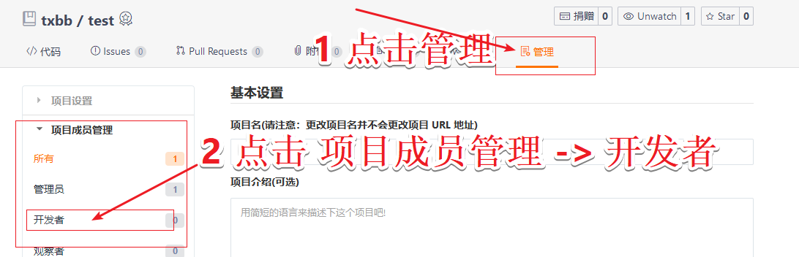

------

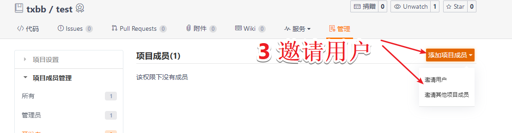

------

------

​	

提示:

### 组员接收项目邀请

​	为项目添加完组员之后,此时,组员登录自己的码云,可查看到一条邀请信息,点击确定即可.

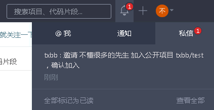

------

------

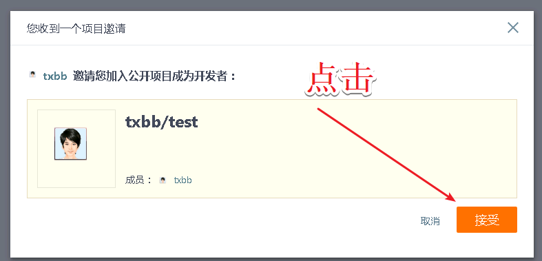

### 添加项目成员成功

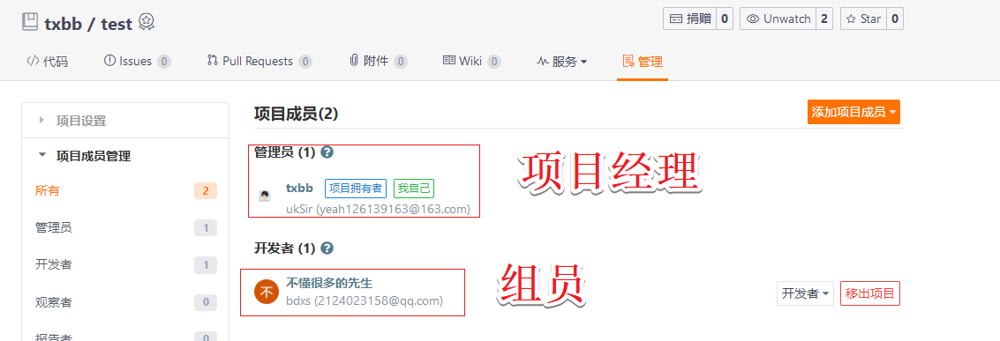

## 冲突

​	冲突可以简答描述为 当多人对同一份代码进行编译保存时,git不知道应该保留哪一个修改的版本,从而把保存的策略交由用户,让用户自己来决定.

​	以下为冲突产生的演示,以及冲突的解决方案.

### 项目人员

​	项目人员为两人,

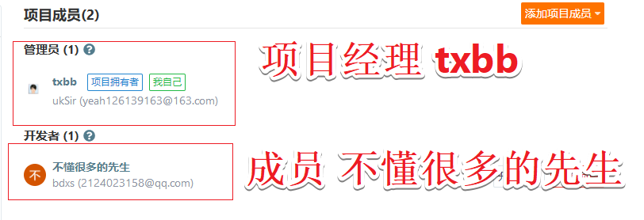

### 步骤1

​	远程仓库上存在有以下文件,内容都为空

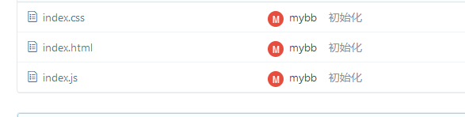

### 步骤2

​	此时,**txbb** 和 **不懂先生** 分别克隆了一份代码到本地上

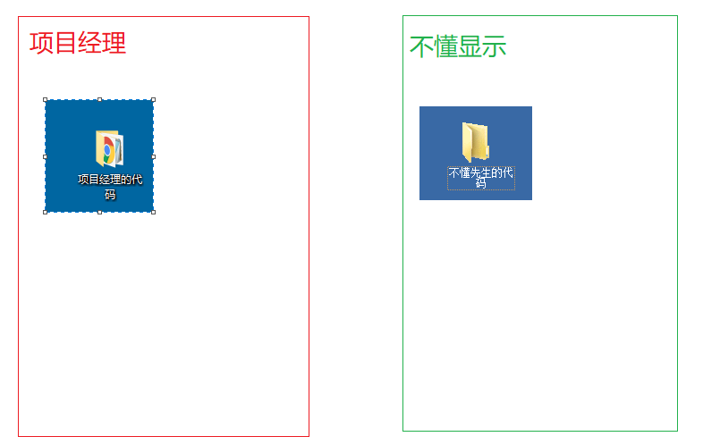

### 步骤3

​	此时,项目经理操作文件 **index.css**

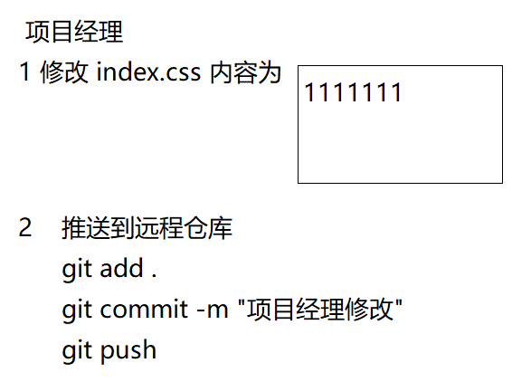

### 步骤4

​	不懂先生 操作文件 **index.css**

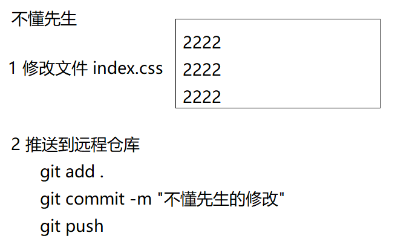

### 推送失败

​	在执行完上述操作后,发现 **git** 有如下提示

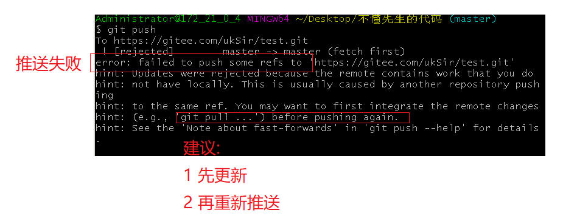

### 推送失败的原因解释
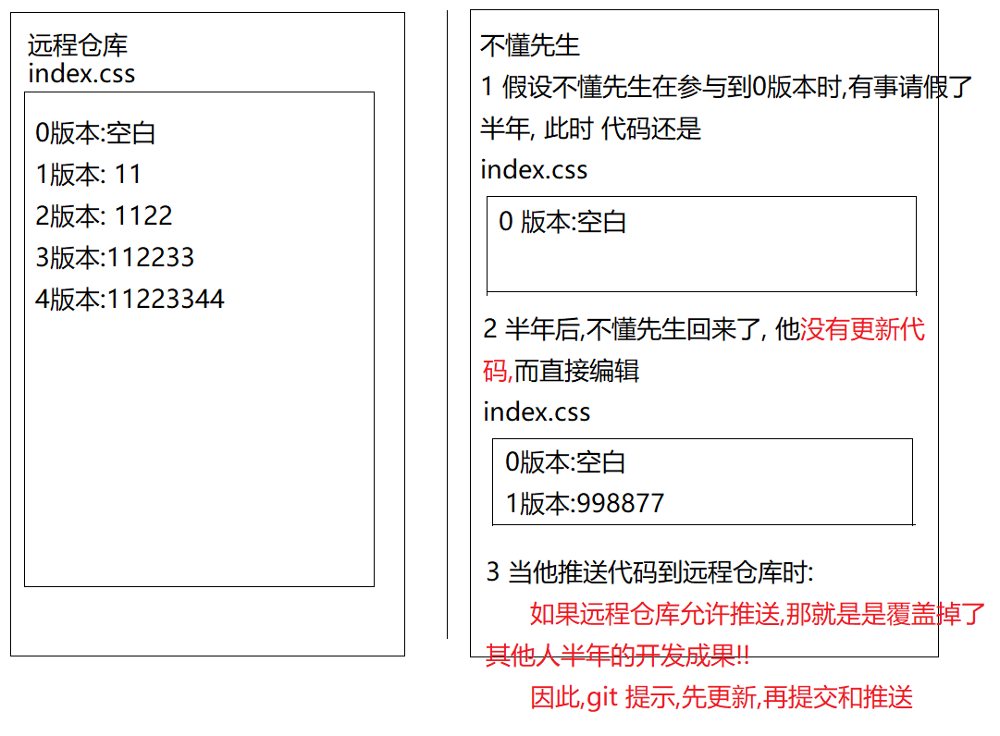

### 冲突产生

​	不懂先生,于是,执行更新  `git pull`

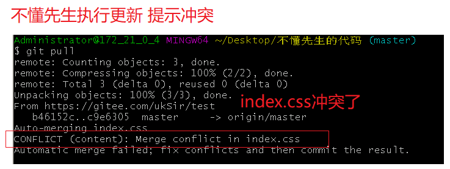

### 冲突产生解释

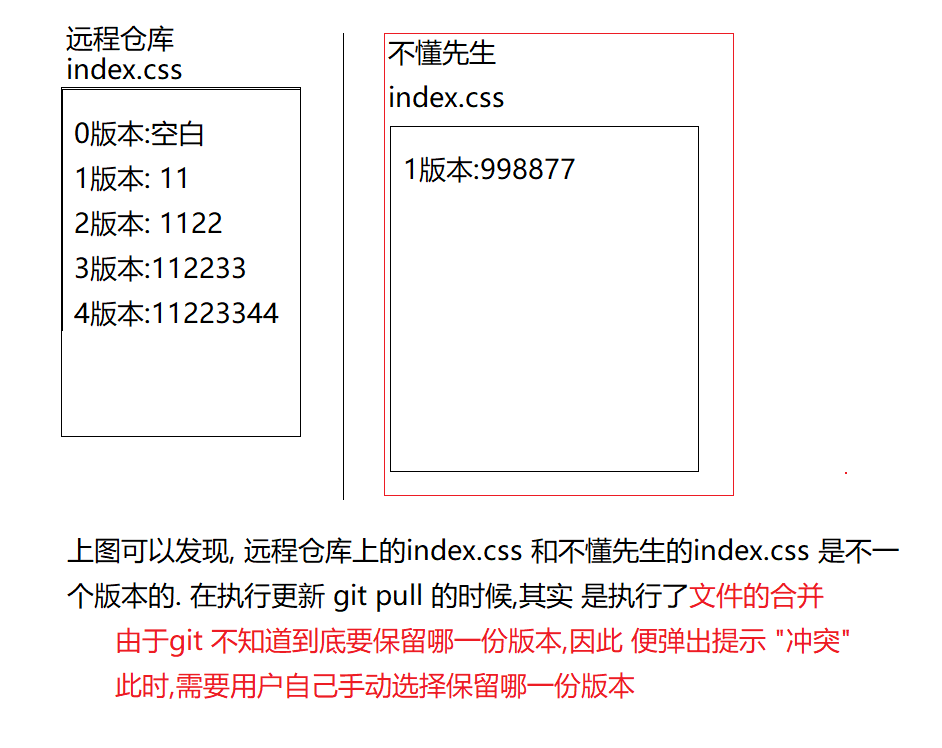

### 解决冲突

​	不懂先生打开提示冲突的文件 `index.css` 手动编辑

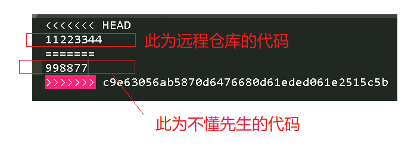

​	此时,需要和项目团队讨论,到底要把 `index.css` 保留成什么样子 如 经过讨论,得出结论:

​	 **只需要把不懂先生的代码,放在远程仓库的代码后面即可**

​	于是手动修改  `index.css`

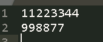

​	完成修改后,添加到本地仓库中,再执行推送即可

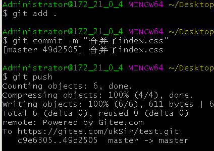

### 总结

​	至此发现,在多人协作时,只要按照以下步骤,即可最大化的避免冲突的产生

1. 上班开始写新的代码时,一定要先做一次更新 
2. 在写完每一个功能时,一定要提交和推送到远程仓库
3. 下班前,一定要记得再把今天代码推送到远程仓库
4. 尽量避免多人同时操作同一个文件
5. 冲突的文件的修改往往需要经过讨论
6. 先提交的人么有冲突,后提交的人容易出现冲突

​	

## 常用命令

| 注解                                       | 命令                                |
| ------------------------------------------ | ----------------------------------- |
| git reset HEAD XXX                         | 从暂存区移出                        |
| git diff                                   | 查看编辑过的文件和 版本库的区别     |
| git config user.name xxx                   | 配置当前仓库的用户名                |
| git config user.email xxx                  | 配置当前仓库的邮箱                  |
| git init                                   | 初始化 git 仓库                     |
| git add xxx                                | 添加到暂存区                        |
| git commit -m "备注"                       | 提交到本地仓库                      |
| git commit -m "备注" -a                    | git add 和 git commit 的综合        |
| git remote -v                              | 查看远程仓库地址                    |
| git remote add 远程仓库名 远程仓库地址     | 添加远程仓库地址                    |
| git remote rm 远程仓库名                   | 删除远程仓库                        |
| git remote set-url 远程仓库名 远程仓库地址 | 修改远程仓库地址                    |
| git push 远程仓库地址 master               | 提交到远程仓库                      |
| git push 远程仓库地址 master -u            | 提交到远程仓库 (以后 git push 即可) |
| git clone 远程仓库地址                     | 克隆仓库                            |
| git pull                                   | 拉取更新                            |
| ssh-keygen -t rsa -C "邮箱地址"            | 生成 ssh证书                        |
| cat ~/.ssh/id_rsa.pub                      | 查看ssh证书                         |
| git reset --hard "commit Id"               | 还原到某版本                        |
| git reset --hared HEAD^                    | 还原到上一个版本                    |
| git log                                    | 查看版本历史                        |
| git reflog                                 | 查看更强大的版本历史                |
| git checkout 文件名                        | 还原文件到上一个版本                |
| git branch 分支名                          | 创建分支                            |
| git checkout 分支名                        | 切换到分支                          |
| git merge 分支名                           | 合并分支                            |
| git branch                                 | 查看分支                            |
| git branch -d 分支名                       | 删除分支                            |